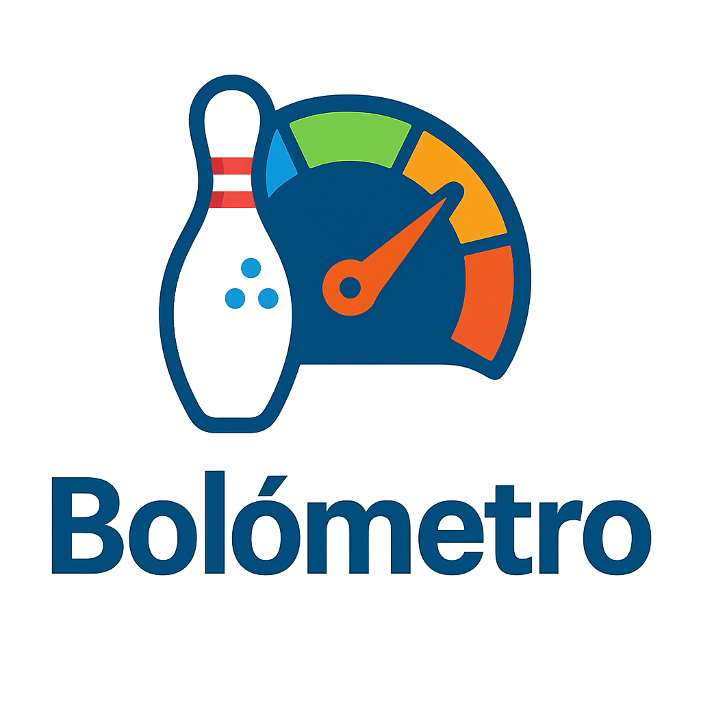

# 🎳 Bolómetro

<p align="center">
  
</p>

<p align="center">
  <strong>La aplicación definitiva para jugadores de bolos</strong>
</p>

<p align="center">
  Registra, analiza y mejora tu rendimiento en cada sesión y partida
</p>

---

## 📋 Descripción

**Bolómetro** es una aplicación móvil multiplataforma desarrollada en Flutter que permite a los jugadores de bolos llevar un seguimiento completo de su rendimiento. Diseñada tanto para jugadores aficionados como profesionales, Bolómetro te ayuda a:

- 📊 **Registrar** sesiones de entrenamiento y competición
- 🎯 **Analizar** estadísticas detalladas de tu juego
- 📈 **Visualizar** tu evolución a lo largo del tiempo
- 🏆 **Mejorar** tu técnica con datos objetivos
- 💾 **Guardar** todas tus partidas de forma local y segura
- ☁️ **Sincronizar** tus datos en la nube con tu cuenta de Google

## ✨ Características Principales

### 🎯 Registro de Partidas
- **Marcador completo de bolos** con validación en tiempo real
- Registro rápido de partidas individuales
- Sesiones completas con múltiples partidas
- Soporte para frames especiales (strike, spare, décimo frame)
- Notas y observaciones para cada sesión

### 📊 Estadísticas Avanzadas
- **KPIs dinámicos**: promedio, mejor partida, total de partidas
- **Análisis de rachas**: strikes y spares consecutivos
- **Gráficos visuales**:
  - Histograma de distribución de puntuaciones
  - Gráfico de promedio móvil
  - Diagrama de pastel de strikes/spares
  - Mapa de calor por calendario
- **Top partidas**: ranking de mejores puntuaciones
- Filtros por tipo de sesión y rango de fechas

### 👤 Perfil de Usuario
- Gestión de perfil personal
- Avatar personalizable (desde galería o cámara)
- Información del jugador: club, mano dominante, fecha de nacimiento
- Biografía y notas personales

### 🎨 Personalización
- **Temas**: Modo claro, oscuro o automático según el sistema
- **Idiomas**: Español e Inglés
- Interfaz intuitiva y moderna con Material Design

### 💾 Almacenamiento y Sincronización
- **Almacenamiento local** con Hive (funciona sin internet)
- **Autenticación con Google** para sincronización en la nube
- **Sincronización automática** de datos con Firebase Firestore
- **Cambio de dispositivo** sin perder datos
- Exportación de datos a formato compartible
- Respaldo en la nube con autenticación segura

## 🚀 Tecnologías

- **Framework**: Flutter 3.8.1+
- **Lenguaje**: Dart
- **Base de datos**: Hive (NoSQL local)
- **Gestión de estado**: Provider
- **Gráficos**: FL Chart
- **Backend (opcional)**: Firebase (Auth, Firestore)
- **Iconos**: Font Awesome, Material Design Icons

## 📱 Plataformas Soportadas

- ✅ Android
- ✅ iOS
- ✅ Web
- ✅ Windows
- ✅ macOS
- ✅ Linux

## 🛠️ Requisitos Previos

- Flutter SDK 3.8.1 o superior
- Dart SDK 3.8.1 o superior
- Android Studio / Xcode (para desarrollo móvil)
- Git

## 📦 Instalación

### 1. Clonar el repositorio
```bash
git clone https://github.com/ivansanare93/Bolometro.git
cd Bolometro
```

### 2. Instalar dependencias
```bash
flutter pub get
```

### 3. Generar archivos de Hive
```bash
flutter pub run build_runner build --delete-conflicting-outputs
```

### 4. Ejecutar la aplicación
```bash
# Modo debug
flutter run

# Modo release
flutter run --release
```

### 5. Construir para producción

**Android (APK)**
```bash
flutter build apk --release
```

**Android (App Bundle)**
```bash
flutter build appbundle --release
```

**iOS**
```bash
flutter build ios --release
```

**Web**
```bash
flutter build web --release
```

## 🏗️ Arquitectura

### Estructura del Proyecto

```
lib/
├── main.dart                 # Punto de entrada de la aplicación
├── models/                   # Modelos de datos (Hive)
│   ├── partida.dart         # Modelo de partida individual
│   ├── sesion.dart          # Modelo de sesión (conjunto de partidas)
│   └── perfil_usuario.dart  # Modelo de perfil de usuario
├── screens/                  # Pantallas principales
│   ├── home.dart            # Pantalla principal con navegación
│   ├── login_screen.dart    # Pantalla de inicio de sesión
│   ├── registro_sesion.dart # Registro rápido de partida
│   ├── registro_completo_sesion.dart # Registro de sesión completa
│   ├── lista_sesiones.dart  # Lista de todas las sesiones
│   ├── ver_sesion.dart      # Detalles de una sesión
│   ├── editar_partida.dart  # Edición de partida
│   ├── estadisticas.dart    # Dashboard de estadísticas
│   └── perfil_usuario.dart  # Gestión de perfil
├── services/                # Servicios de backend
│   ├── auth_service.dart    # Autenticación con Google
│   └── firestore_service.dart # Sincronización con Firestore
├── repositories/            # Capa de acceso a datos
│   └── data_repository.dart # Abstracción de Hive y Firestore
├── widgets/                 # Componentes reutilizables
│   ├── marcador_bolos.dart  # Marcador de bolos
│   ├── teclado_selector_pins.dart # Teclado para seleccionar pines
│   ├── estadisticas/        # Widgets de estadísticas
│   └── ...
├── providers/               # Gestión de estado
│   ├── theme_provider.dart  # Tema de la aplicación
│   └── language_provider.dart # Idioma de la aplicación
├── utils/                   # Utilidades y helpers
│   ├── estadisticas_utils.dart # Cálculos estadísticos
│   ├── estadisticas_cache.dart # Cache de estadísticas
│   ├── registro_tiros_utils.dart # Lógica de registro de tiros
│   └── database_utils.dart  # Utilidades de base de datos
└── theme/                   # Configuración de temas
    └── app_theme.dart       # Temas claro y oscuro
```

### Patrón de Diseño

- **Arquitectura**: MVVM (Model-View-ViewModel) con Repository Pattern
- **Gestión de estado**: Provider para temas, idiomas, autenticación y caché
- **Persistencia**: Hive (local) + Firestore (cloud) con sincronización
- **Autenticación**: Firebase Authentication con Google Sign-In
- **Navegación**: Navigator 2.0 con rutas nombradas

### Optimizaciones Implementadas

- ✅ **Lazy Loading**: Carga paginada de sesiones (20 por página)
- ✅ **Cache de Estadísticas**: Cálculos optimizados con invalidación inteligente
- ✅ **Manejo Robusto de Errores**: Try-catch en todos los accesos a base de datos
- ✅ **Pull-to-Refresh**: Actualización manual de datos
- ✅ **Sincronización en la Nube**: Backup automático con Firebase

## 📖 Guía de Uso

### Iniciar Sesión (Primera Vez)

1. Al abrir la app, verás la pantalla de bienvenida
2. **Opción 1**: Toca "Continuar con Google" para iniciar sesión
   - Tus datos se sincronizarán automáticamente en la nube
   - Podrás acceder desde cualquier dispositivo
3. **Opción 2**: Toca "Continuar sin iniciar sesión"
   - Los datos se guardarán solo localmente
   - Podrás iniciar sesión más tarde desde ajustes

### Registrar una Partida Rápida

1. Abre la aplicación
2. En la pantalla principal, toca el botón "+" flotante
3. Ingresa las puntuaciones frame por frame
4. El sistema validará automáticamente strikes, spares y puntuaciones
5. Guarda la partida con ubicación y notas opcionales

### Crear una Sesión Completa

1. Ve a la pestaña "Sesiones"
2. Toca "Nueva Sesión"
3. Selecciona el tipo (Entrenamiento/Competición)
4. Agrega múltiples partidas a la sesión
5. Guarda con notas y detalles

### Ver Estadísticas

1. Ve a la pestaña "Estadísticas"
2. Explora tus KPIs: promedio, mejor partida, rachas
3. Filtra por tipo de sesión o rango de fechas
4. Revisa gráficos de evolución y distribución

### Sincronizar Datos (Usuario Autenticado)

1. Ve a "Ajustes" (icono de engranaje)
2. Verás tu estado de autenticación
3. Toca "Sincronizar datos" para guardar en la nube manualmente
4. La sincronización automática ocurre al guardar sesiones

### Personalizar la App

1. Ve a "Perfil"
2. Configura tu información personal
3. Cambia el tema (claro/oscuro/automático)
4. Selecciona tu idioma preferido (ES/EN)

## 🤝 Contribuciones

Las contribuciones son bienvenidas. Para cambios importantes:

1. Fork el proyecto
2. Crea una rama para tu feature (`git checkout -b feature/AmazingFeature`)
3. Commit tus cambios (`git commit -m 'Add some AmazingFeature'`)
4. Push a la rama (`git push origin feature/AmazingFeature`)
5. Abre un Pull Request

### Guías de Contribución

- Sigue las convenciones de código de Dart/Flutter
- Ejecuta `flutter analyze` antes de hacer commit
- Añade tests para nuevas funcionalidades
- Actualiza la documentación según sea necesario

## 🧪 Testing

```bash
# Ejecutar todos los tests
flutter test

# Ejecutar con cobertura
flutter test --coverage
```

## 📄 Licencia

Este proyecto es de código cerrado y uso personal. Todos los derechos reservados.

## 👨‍💻 Autor

**Iván Sanare**

- GitHub: [@ivansanare93](https://github.com/ivansanare93)

## 📞 Soporte

Para reportar bugs o solicitar nuevas características, por favor abre un [issue](https://github.com/ivansanare93/Bolometro/issues) en GitHub.

## 🙏 Agradecimientos

- Comunidad de Flutter
- Paquetes de código abierto utilizados
- Jugadores de bolos que inspiraron esta aplicación

---

<p align="center">
  Hecho con ❤️ y Flutter
</p>
