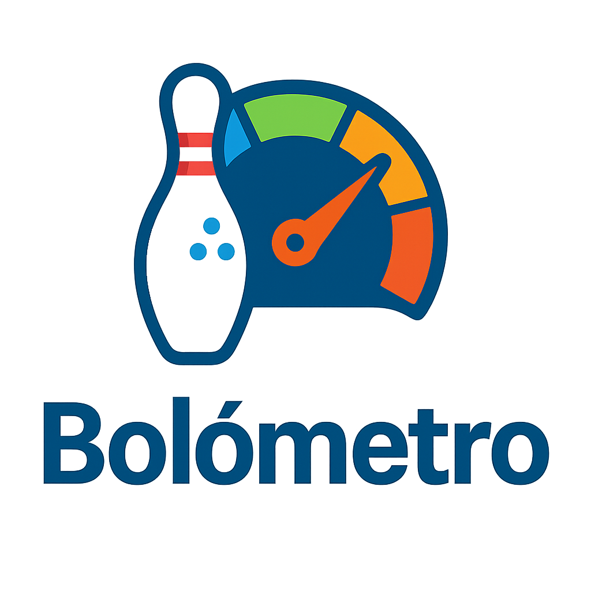

# 🎳 Bolómetro

<p align="center">
  
</p>

<p align="center">
  <strong>Registra tus partidas, analiza tu evolución y mejora tu juego de bolos.</strong>
</p>

---

## 📌 Estado actual

**Bolómetro** es una app Flutter multiplataforma centrada en el seguimiento y mejora del rendimiento en bolos.

### Funcionalidades principales implementadas

- Registro de partidas y sesiones completas.
- Estadísticas y visualizaciones de rendimiento.
- Sistema de logros y nivel (gamificación).
- Sistema social: amigos, solicitudes y rankings.
- Perfil de usuario y personalización básica.
- Modo offline con almacenamiento local (Hive).
- Sincronización cloud con Firebase (Google Sign-In + Firestore).
- Soporte multi-plataforma: Android, iOS, Web, Windows, macOS y Linux.

---

## 🧱 Stack tecnológico

- **Framework:** Flutter
- **Lenguaje:** Dart
- **Persistencia local:** Hive
- **Backend:** Firebase (Auth, Firestore, Cloud Functions, FCM)
- **Estado:** Provider
- **Gráficas:** FL Chart

---

## 🚀 Arranque rápido

```bash
git clone https://github.com/ivansanare93/Bolometro.git
cd Bolometro
flutter pub get
flutter pub run build_runner build --delete-conflicting-outputs
flutter run
```

---

## 📚 Documentación técnica

La documentación detallada está en [`docs/`](docs/).

Documentos recomendados para empezar:

- [`docs/GAMIFICATION.md`](docs/GAMIFICATION.md)
- [`docs/FRIENDS_SYSTEM.md`](docs/FRIENDS_SYSTEM.md)
- [`docs/ANALYTICS.md`](docs/ANALYTICS.md)
- [`docs/TESTING.md`](docs/TESTING.md)
- [`docs/CICD.md`](docs/CICD.md)

> Nota: se ha simplificado este README para evitar duplicidad y mantener aquí solo información de alto nivel.

---

## 🗺️ Siguientes pasos (post-temporadas)

Una vez cerrada la implementación total de temporadas, el roadmap propuesto es:

1. **Integración total de temporadas en estadísticas y rankings**
   - Filtros por temporada en todas las vistas clave.
   - Comparativas entre temporadas.
   - Métricas históricas por temporada.

2. **Mejoras de experiencia de usuario**
   - Flujos de registro más rápidos.
   - Mejor feedback visual en acciones clave.
   - Revisión de estados vacíos y mensajes de error.

3. **Calidad técnica y mantenibilidad**
   - Refuerzo de pruebas unitarias/integración en módulos de temporada.
   - Limpieza incremental de documentación técnica obsoleta.
   - Revisión de rendimiento en consultas y cálculos agregados.

4. **Evolución social y competitiva**
   - Más tipos de ranking vinculados a temporadas.
   - Retos periódicos por temporada (futuro).

---

## 🧠 Idea futura: “Entrenador”

Se propone incorporar un módulo de **Entrenador** que ofrezca tips accionables y personalizados, por ejemplo:

- Recomendaciones según tus patrones (spares fallados, consistencia, frames críticos).
- Sugerencias de objetivos semanales (p. ej. subir % de spare en X puntos).
- Alertas inteligentes de progreso/retroceso.
- Resúmenes tipo “qué mejorar en tu próxima sesión”.

### Primera versión (MVP sugerido)

- Reglas simples basadas en métricas ya existentes.
- Tips en lenguaje natural dentro de la pantalla de estadísticas.
- Sistema de prioridad de recomendaciones (máx. 2–3 tips por sesión).

---

## 🤝 Contribución

Si quieres colaborar:

1. Crea una rama de trabajo.
2. Implementa cambios con pruebas.
3. Abre un Pull Request con contexto y capturas si aplica.

---

## 👨‍💻 Autor

**Iván Sanare**  
GitHub: [@ivansanare93](https://github.com/ivansanare93)
