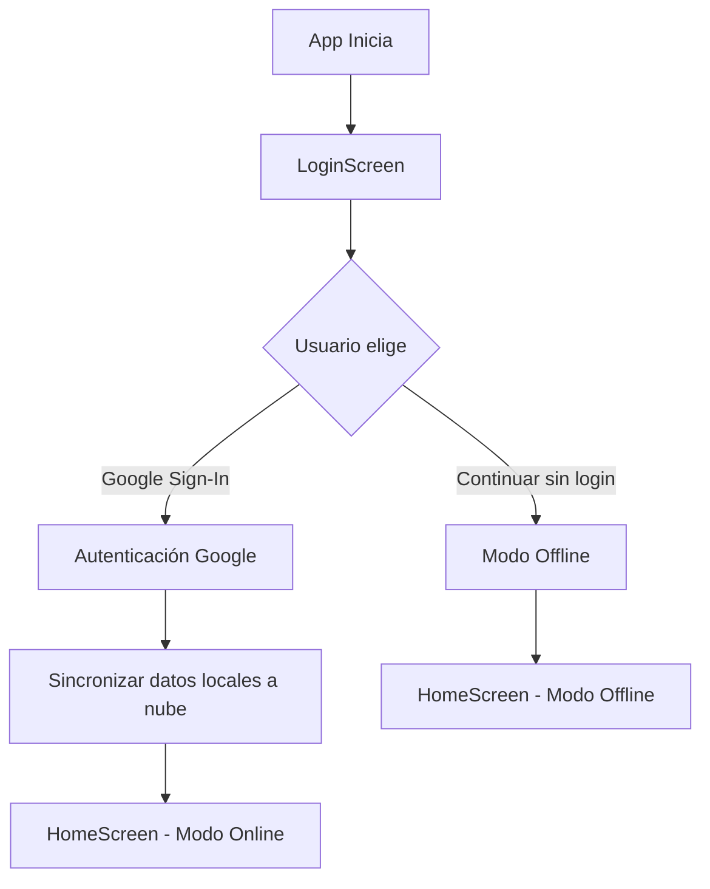
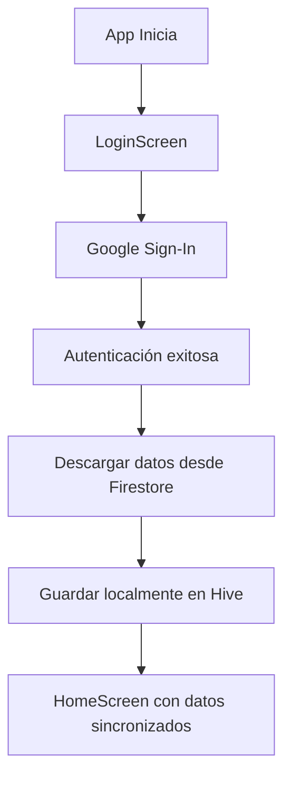
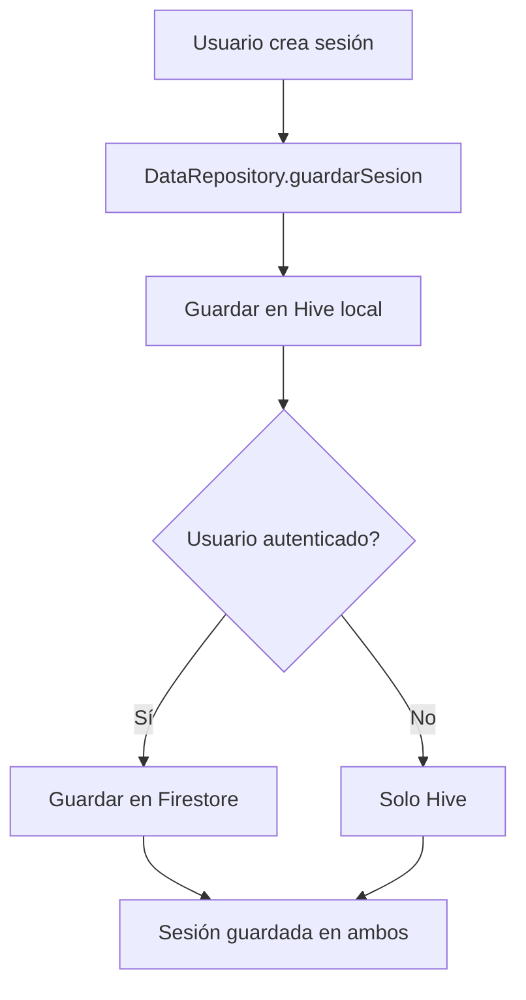

# Sistema de Autenticación y Sincronización en la Nube

## Resumen

Bolómetro ahora incluye un sistema de autenticación con Google Play Store que permite a los usuarios sincronizar sus datos entre dispositivos y mantener copias de seguridad en la nube.

## Características

### 🔐 Autenticación con Google

- **Inicio de sesión con Google**: Los usuarios pueden iniciar sesión con su cuenta de Google de forma segura
- **Modo offline opcional**: Los usuarios pueden continuar usando la app sin iniciar sesión
- **Cierre de sesión**: Los datos locales se mantienen al cerrar sesión

### ☁️ Sincronización en la Nube

- **Firestore**: Los datos se almacenan en Firebase Firestore
- **Sincronización automática**: Al iniciar sesión, los datos locales se sincronizan automáticamente
- **Sincronización manual**: Los usuarios pueden sincronizar datos manualmente desde ajustes
- **Persistencia local**: Los datos se guardan localmente con Hive como respaldo

### 📱 Cambio de Dispositivo

- Los usuarios autenticados pueden acceder a sus datos desde cualquier dispositivo
- Al iniciar sesión en un nuevo dispositivo, los datos se descargan automáticamente

## Arquitectura

### Capas de la Aplicación

```
┌─────────────────────────────────────┐
│   Pantallas (Screens)               │
│   - LoginScreen                     │
│   - HomeScreen                      │
│   - ListaSesionesScreen             │
└────────────┬────────────────────────┘
             │
┌────────────▼────────────────────────┐
│   Repositorio (DataRepository)      │
│   - Abstrae acceso a datos          │
│   - Maneja modo online/offline      │
└────────┬───────────┬────────────────┘
         │           │
┌────────▼──────┐  ┌▼────────────────┐
│ Hive (Local)  │  │ Firestore (Cloud)│
│ - Respaldo    │  │ - Sincronización │
│ - Modo offline│  │ - Persistencia   │
└───────────────┘  └──────────────────┘
```

### Componentes Principales

#### 1. AuthService (`lib/services/auth_service.dart`)

Gestiona la autenticación de usuarios:

- `signInWithGoogle()`: Inicia sesión con Google
- `signOut()`: Cierra sesión
- Notifica cambios en el estado de autenticación

#### 2. FirestoreService (`lib/services/firestore_service.dart`)

Maneja la comunicación con Firestore:

- `guardarSesion()`: Guarda una sesión en la nube
- `obtenerSesiones()`: Obtiene sesiones del usuario
- `obtenerSesionesPaginadas()`: Carga sesiones con paginación
- `sincronizarDatosLocales()`: Migra datos de Hive a Firestore

#### 3. DataRepository (`lib/repositories/data_repository.dart`)

Abstrae el acceso a datos y decide entre local/remoto:

- Modo **online**: Lee y escribe en Firestore + Hive
- Modo **offline**: Solo usa Hive
- Sincronización transparente para el usuario

#### 4. EstadisticasCache (`lib/utils/estadisticas_cache.dart`)

Optimiza cálculos estadísticos:

- Cache inteligente de estadísticas
- Recalcula solo cuando hay cambios
- Expira automáticamente después de 5 minutos

## Flujo de Uso

### Primera Vez (Usuario Nuevo)



### Usuario Existente (Nuevo Dispositivo)



### Guardar Nueva Sesión



## Estructura de Datos en Firestore

```
users/
  {userId}/
    perfil: {
      nombre: string
      email: string
      club: string
      manoDominante: string
      fechaNacimiento: string (ISO)
      bio: string
      avatarPath: string
    }
    sesiones/
      {sesionId}/
        fecha: string (ISO)
        lugar: string
        tipo: string ("Entrenamiento" | "Competición")
        notas: string
        partidas: [
          {
            fecha: string (ISO)
            lugar: string
            frames: [[string]]
            notas: string
            total: number
            pinesPorTiro: [[[number]]]
          }
        ]
```

## Optimizaciones Implementadas

### ✅ Lazy Loading

- Las listas de sesiones cargan datos de forma paginada (20 sesiones por página)
- Se cargan más datos automáticamente al hacer scroll
- Mejora el rendimiento con muchas sesiones

### ✅ Cache de Estadísticas

- Las estadísticas se calculan una vez y se cachean
- El cache se invalida automáticamente cuando cambian los datos
- Reduce cálculos redundantes en cada rebuild

### ✅ Manejo Robusto de Errores

- Todos los accesos a Hive incluyen try-catch
- Mensajes de error claros para el usuario
- Recuperación automática de errores de base de datos

### ✅ Pull-to-Refresh

- Los usuarios pueden actualizar las listas deslizando hacia abajo
- Recarga datos frescos desde Firestore (si está autenticado)

## Configuración de Firebase

### Android

1. **google-services.json**: Ya configurado en `android/app/google-services.json`
2. **build.gradle.kts**: Plugin de Google Services activado
3. **Firebase BoM**: Versión 34.0.0 configurada

### iOS

Para configurar iOS en el futuro:

1. Descargar `GoogleService-Info.plist` desde Firebase Console
2. Agregar al proyecto iOS en Xcode
3. Configurar URL schemes en `Info.plist`

## Dependencias Añadidas

```yaml
dependencies:
  firebase_core: ^2.31.0        # Core de Firebase
  firebase_auth: ^4.19.3        # Autenticación
  cloud_firestore: ^4.16.1      # Base de datos en la nube
  firebase_app_check: ^0.3.1+6  # Integridad (Google Play Integrity API)
  google_sign_in: ^6.2.1        # Sign-In con Google
```

> Para la configuración completa de Google Play Integrity, consulta [PLAY_INTEGRITY.md](PLAY_INTEGRITY.md).

## Uso para Desarrolladores

### Acceder al usuario autenticado

```dart
final authService = Provider.of<AuthService>(context, listen: false);
if (authService.isAuthenticated) {
  final userId = authService.userId;
  final email = authService.user?.email;
}
```

### Guardar datos

```dart
final dataRepository = Provider.of<DataRepository>(context, listen: false);
await dataRepository.guardarSesion(sesion);
// Se guarda automáticamente en Hive y Firestore (si está autenticado)
```

### Cargar datos

```dart
final dataRepository = Provider.of<DataRepository>(context, listen: false);
final sesiones = await dataRepository.obtenerSesiones();
// Carga desde Firestore si está autenticado, sino desde Hive
```

### Usar cache de estadísticas

```dart
final cache = Provider.of<EstadisticasCache>(context, listen: false);
final stats = cache.getEstadisticas(sesiones);
final promedio = stats['promedioGeneral'];
final mejorPartida = stats['mejorPartida'];
```

## Próximas Funcionalidades

Con el sistema de autenticación en su lugar, ahora es posible implementar:

- 👥 **Añadir amigos**: Compartir estadísticas con otros usuarios
- 🏆 **Tablas de clasificación**: Competir con amigos
- 📊 **Comparar rendimiento**: Ver estadísticas de múltiples usuarios
- 💬 **Comentarios en sesiones**: Dejar notas en partidas de amigos
- 🎯 **Retos y logros**: Sistema de gamificación

## Notas de Seguridad

- Las credenciales de Google nunca se almacenan localmente
- Firebase Authentication maneja la seguridad de sesiones
- Firestore Security Rules deben configurarse para permitir solo acceso del propietario:

```javascript
rules_version = '2';
service cloud.firestore {
  match /databases/{database}/documents {
    match /users/{userId}/{document=**} {
      allow read, write: if request.auth != null && request.auth.uid == userId;
    }
  }
}
```

## Solución de Problemas

### Error "ApiException: 10" al iniciar sesión con Google

Este es el error más común al configurar Google Sign-In. Significa que la app no está correctamente configurada en Google Cloud Console. Sigue estos pasos para solucionarlo:

#### Paso 1: Obtener el SHA-1 de tu app

**Para debug (desarrollo):**

```bash
cd android
./gradlew signingReport
```

Busca en la salida la línea que dice `SHA1:` en la sección `Variant: debug`. Copia ese valor.

**Alternativa usando keytool:**

En Windows:
```bash
keytool -list -v -keystore "%USERPROFILE%\.android\debug.keystore" -alias androiddebugkey -storepass android -keypass android
```

En macOS/Linux:
```bash
keytool -list -v -keystore ~/.android/debug.keystore -alias androiddebugkey -storepass android -keypass android
```

**Para release (producción):**

Si ya tienes un keystore de release, usa:
```bash
keytool -list -v -keystore path/to/your/keystore.jks -alias your-alias
```

#### Paso 2: Agregar el SHA-1 a Firebase Console

1. Ve a [Firebase Console](https://console.firebase.google.com/)
2. Selecciona tu proyecto Bolómetro
3. Ve a "Configuración del proyecto" (ícono de engranaje arriba a la izquierda)
4. Desplázate hasta la sección "Tus apps"
5. Selecciona tu app Android (com.bolometro)
6. En la sección "Huellas digitales de certificados SHA", haz clic en "Agregar huella digital"
7. Pega el SHA-1 que copiaste en el Paso 1
8. Haz clic en "Guardar"

#### Paso 3: Descargar el google-services.json actualizado

1. Después de agregar el SHA-1, descarga el nuevo archivo `google-services.json`
2. Reemplaza el archivo existente en `android/app/google-services.json`
3. Verifica que el `package_name` en el archivo coincida con `com.bolometro`

#### Paso 4: Limpiar y reconstruir la app

```bash
flutter clean
flutter pub get
cd android
./gradlew clean
cd ..
flutter run
```

#### Paso 5: Verificar la configuración

Asegúrate de que:

- El `applicationId` en `android/app/build.gradle.kts` sea `com.bolometro`
- El plugin de Google Services esté aplicado: `id("com.google.gms.google-services")`
- El archivo `google-services.json` esté en `android/app/`
- Firebase Authentication esté habilitado en Firebase Console (con Google como proveedor)

### "Error al iniciar sesión"

Si recibes un error genérico al iniciar sesión:

- Verificar que google-services.json esté actualizado (ver arriba)
- Comprobar que el SHA-1 esté configurado en Firebase Console (ver arriba)
- Revisar que el paquete en google-services.json coincida con applicationId
- Asegurarse de que Google Sign-In esté habilitado en Firebase Console:
  1. Ve a Authentication > Sign-in method
  2. Habilita "Google" como proveedor
  3. Agrega un correo de soporte

### "Datos no se sincronizan"

- Verificar conexión a Internet
- Comprobar que el usuario esté autenticado en ajustes
- Intentar sincronización manual desde ajustes
- Revisar las reglas de seguridad de Firestore (ver sección "Notas de Seguridad")

### "App crashea al abrir"

- Verificar que Firebase esté inicializado en main.dart
- Comprobar que todas las dependencias estén instaladas: `flutter pub get`
- Revisar logs de Android Studio/Xcode con `flutter logs`
- Verificar que el archivo google-services.json sea válido (formato JSON correcto)

### Modo sin conexión funciona pero Google Sign-In no

Si la app funciona en modo offline pero falla al iniciar sesión con Google:

1. Verifica que tengas conexión a Internet
2. Asegúrate de que los servicios de Google Play estén actualizados en tu dispositivo
3. Limpia el cache de la app: Ajustes > Apps > Bolómetro > Almacenamiento > Limpiar cache
4. Desinstala y reinstala la app
5. Intenta con una cuenta de Google diferente

### Error de red o timeout

Si recibes errores de red:

- Verifica tu conexión a Internet
- Asegúrate de que Firebase no esté experimentando problemas: [Estado de Firebase](https://status.firebase.google.com/)
- Verifica que los servicios de Google Play estén funcionando
- Intenta desactivar VPN si estás usando una

## Testing

Para probar el flujo completo:

1. **Instalación limpia**: Desinstalar y reinstalar la app
2. **Iniciar sesión**: Probar con cuenta de Google
3. **Crear datos**: Añadir sesiones y partidas
4. **Cerrar sesión**: Verificar que datos locales persisten
5. **Nuevo dispositivo**: Instalar en otro dispositivo e iniciar sesión
6. **Verificar sincronización**: Comprobar que los datos aparecen

---

**Última actualización**: 2026-01-26
**Versión**: 1.0.0
**Autor**: Sistema de autenticación implementado para Bolómetro
